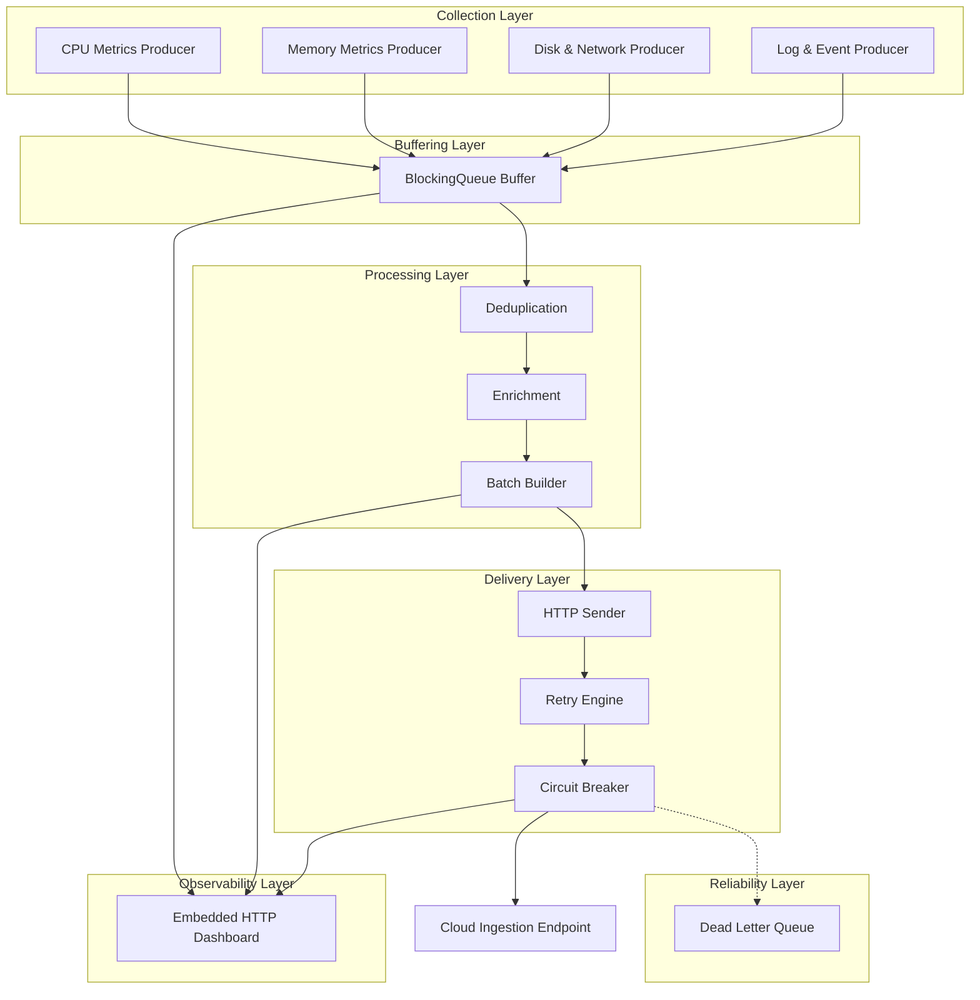

# MetricsShipper

**Internal Infrastructure Telemetry Agent (v1)**

MetricsShipper is a lightweight, production-oriented telemetry agent designed for collecting, processing, and reliably delivering system metrics and events from infrastructure hosts to a centralized observability backend.

It is designed for internal use in distributed environments such as server fleets and Kubernetes clusters.

---

## Key Capabilities

* High-performance, multi-threaded metrics collection (CPU, Memory, Disk, Network)
* Custom event and log ingestion pipeline
* Backpressure-aware Producer–Consumer architecture
* Batch-based processing for efficient network utilization
* Resilient delivery with:

  * Exponential backoff retry
  * Circuit breaker protection
* Dead Letter Queue (DLQ) for failed deliveries
* Embedded HTTP Dashboard for runtime observability
* Graceful shutdown with in-flight data protection

---

## Quick Start

### Requirements

* Java 21+
* Maven 3.8+

---

### Build & Run

```bash id="b1k9xx"
mvn clean package
java -jar target/metricsshipper-1.0.0.jar
```

---

### Dashboard

Once the service is running:

```
http://localhost:8080
```

---

## Configuration

Configuration is defined via YAML:

```text id="cfg1"
config/application.yaml.example → config/application.yaml
```

Supports:

* Environment variable overrides
* Safe defaults
* Runtime tuning (batch size, intervals, endpoints)

---

## Project Structure

* `collector/` — system metrics & event producers
* `processor/` — enrichment, deduplication, batching
* `sender/` — delivery layer (retry, circuit breaker, HTTP client)
* `dashboard/` — embedded monitoring HTTP server
* `utils/` — shared utilities and helpers

---

## Development Conventions

### Commit Style

This project follows Conventional Commits:

* `feat:` new functionality
* `fix:` bug fixes
* `chore:` maintenance and infrastructure
* `refactor:` internal improvements
* `docs:` documentation updates
* `test:` testing changes

---

## Roadmap

* OpenTelemetry exporter integration
* Kubernetes service discovery
* Prometheus metrics endpoint
* Persistent queue storage
* gRPC ingestion support

---

## Reliability Principles

MetricsShipper is designed with production-grade reliability patterns:

* Bounded queues for backpressure control
* Non-blocking producers under load
* Retry with exponential backoff
* Circuit breaker for dependency protection
* Dead Letter Queue for failed events
* Graceful shutdown handling in multi-threaded environment

---

## License

MIT License — see `LICENSE` file.

---

## Architecture


